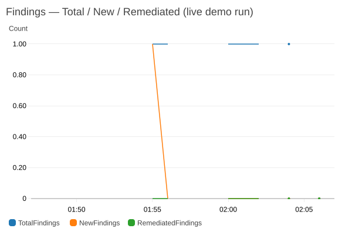
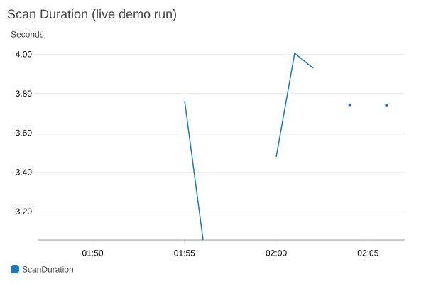

# 🛡️ Cloud Security Posture Scanner

Audits an AWS account against CIS AWS Foundations Benchmark controls,
scores findings by severity, tracks each finding's lifecycle
(active/resolved, not just a growing pile of rows), and optionally
auto-remediates a couple of low-risk ones. Runs on a schedule via
Lambda + EventBridge, not as a script you remember to run manually.

**Status:** ✅ complete, including the optional Kubernetes stretch goal — deployed and validated live against a real AWS account and a real cluster.

---

## ⚙️ Architecture
```
EventBridge (schedule) -> Lambda (scanner) -> DynamoDB (findings, active/resolved)
                                            -> SNS (alerts on new Critical/High)
                                            -> (opt-in) remediation of 2 finding types
```
- **Rule engine** (`src/scanner/rules/`) — each check is its own file
  implementing the `Rule` interface; new checks don't touch core logic.
- **Findings lifecycle** — deterministic key (`rule_id#resource_id`), so
  re-scanning upserts instead of duplicating. Findings track ACTIVE vs
  RESOLVED status, and RESOLVED ones auto-expire via DynamoDB TTL after
  30 days instead of accumulating forever.
- **Opt-in remediation** — a rule must explicitly implement `remediate()`
  (only 2 do: S3 public access, RDS public accessibility — both simple,
  reversible setting toggles, nothing destructive), and the scanner only
  acts on rule IDs an operator explicitly lists via `AUTO_REMEDIATE_RULES`
  — empty by default, fully read-only.
- **Least-privilege scanner role** — read-only permissions for detection,
  plus a narrow, separate IAM statement for the 2 remediation actions, so
  the "can actually change something" surface is obvious at a glance.
- **IaC** — infra defined in `terraform/`, not created by hand in the console.

## ✅ CIS checks — 5/5 implemented
Validated against a live sandbox account.

| Check | Remediable |
|---|:---:|
| 🪣 S3 buckets with public access | ✅ |
| 🔑 IAM policies with wildcard (`*:*`) actions | — |
| 🌐 Security groups open to `0.0.0.0/0` on sensitive ports | — |
| 🗄️ RDS instances publicly accessible | ✅ |
| 💾 EBS volumes without encryption | — |

## 📊 Observability
A CloudWatch dashboard (`terraform/main.tf` → `aws_cloudwatch_dashboard.scanner`,
URL via `terraform output dashboard_url`) tracks scan latency, findings
count (total/new/remediated), and a severity breakdown, all published by
`src/scanner/metrics.py` on every invoke — plus Lambda's own free
Invocations/Errors metrics on the same board.

## 🎬 Demo: a real finding, start to finish
This isn't a mockup — these are widget images pulled straight from the
live CloudWatch dashboard after actually running the pipeline against a
throwaway test bucket in the sandbox account:

1. Created `posture-scanner-demo-<timestamp>`, deliberately made it public
   (bucket policy + Block Public Access off).
2. Invoked the deployed Lambda. It found the bucket, wrote a `CRITICAL`
   finding to DynamoDB, and fired an SNS alert:
   ```json
   {"rule_id": "S3.1", "resource_id": "posture-scanner-demo-1788227699",
    "severity": "CRITICAL",
    "message": "S3 bucket 'posture-scanner-demo-1788227699' is publicly accessible."}
   ```
3. Called the S3 rule's `remediate()` directly (turns on all four Block
   Public Access settings), then re-invoked the Lambda. The finding's
   DynamoDB row flipped to `RESOLVED` with a `resolved_at` timestamp and
   a 30-day TTL for auto-cleanup — no duplicate row, same deterministic
   key (`S3.1#posture-scanner-demo-...`) throughout.
4. Deleted the test bucket.




> 🐛 **A real bug turned up mid-demo**, on the first attempt at step 3: the
> Lambda kept re-flagging the bucket as `CRITICAL` even after remediation,
> while a local scan using my own (broader) IAM credentials correctly saw
> it as clean. Added temporary logging, redeployed, and found the actual
> cause in the logs — an `AccessDenied` on `GetPublicAccessBlock`, because
> I'd granted the IAM action `s3:GetPublicAccessBlock` in Terraform, but
> AWS's real action name for that permission is `s3:GetBucketPublicAccessBlock`
> (the API operation and the IAM action name don't match — a genuine AWS
> naming inconsistency, not a typo I could've caught by re-reading the
> code). Fixed the action name, redeployed, and the flow above is the
> result after that fix — the finding resolved correctly on the next
> invoke. Left in `TODO.md` as one more real bug found through live
> testing rather than smoothed over.

## ☸️ Stretch: Kubernetes cluster audit
Extends the same "one rule, one file, one `Finding` type" pattern to a
Kubernetes cluster — separate from the AWS pipeline (`src/scanner/k8s_*`),
since a Lambda has no route to a cluster's API server. Validated against
a real local `kind` cluster with deliberately misconfigured resources —
see `docs/k8s-demo.md` for the real before/after output.

- ✅ **RBAC.1** — `ClusterRoleBinding`s granting `cluster-admin` outside the cluster's own system identities (CIS 5.1.x)
- ✅ **PodSecurity.1** — privileged containers / containers allowing privilege escalation (CIS 5.2.1/5.2.5)
- ✅ **PodSecurity.2** — containers with no `runAsNonRoot` restriction (CIS 5.2.6)
- ✅ **NET.1** — namespaces with running pods and no `NetworkPolicy` at all (CIS 5.3.2)

```bash
pip install -r requirements.txt   # pulls in the kubernetes client too
python -m scanner.k8s_cli --context <kubeconfig-context>
```

## 🚀 Setup
```bash
python -m venv .venv && source .venv/bin/activate
pip install -r requirements.txt
pip install -e .   # src layout — makes `scanner` importable
python -m scanner.cli --profile <aws-profile>   # local run against your own account
```

To deploy the scheduled Lambda pipeline: `cd terraform && terraform apply`.
To enable remediation, set `auto_remediate_rules = "S3.1,RDS.1"` (or a
subset) as a Terraform variable — left empty by default.

## 📌 Status
Everything planned is complete, including the optional K8s stretch:
detection, the serverless pipeline, findings lifecycle, opt-in
remediation, the CloudWatch dashboard, and the Kubernetes cluster audit
are all deployed and validated live. See `TODO.md` for several real bugs
found and fixed along the way — worth reading if you want the honest
version, not just the checklist.
